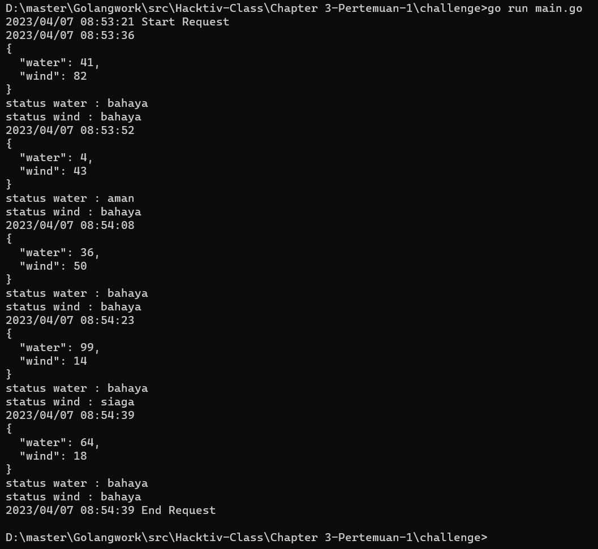

# Chapter 3 - Challenge Pertemuan 1

### Program Golang
```go
package main

import (
	"encoding/json"
	"fmt"
	"io/ioutil"
	"log"
	"math/rand"
	"net/http"
	"strings"
	"time"
)

type weather struct {
	Water int `json:"water"`
	Wind  int `json:"wind"`
}

// Request to API
func request(water int, wind int) weather {
	req := fmt.Sprintf(`{"water": %d, "wind": %d}`, water, wind)
	resp, err := http.Post("https://jsonplaceholder.typicode.com/posts", "application/json", strings.NewReader(req))
	if err != nil {
		log.Println(err)
	}
	defer resp.Body.Close()
	res, err := ioutil.ReadAll(resp.Body)
	if err != nil {
		log.Println(err)
	}
	var weather weather
	json.Unmarshal(res, &weather)
	return weather
}

// Check Status Weather
func checkWeather(weather weather) (string, string) {
	var sts_water, sts_wind string
	if weather.Water < 5 {
		sts_water = "aman"
	} else if weather.Water >= 6 && weather.Water <= 8 {
		sts_water = "siaga"
	} else if weather.Water > 8 {
		sts_water = "bahaya"
	}

	if weather.Wind < 6 {
		sts_wind = "aman"
	} else if weather.Wind >= 7 && weather.Wind <= 15 {
		sts_wind = "siaga"
	} else if weather.Wind > 15 {
		sts_wind = "bahaya"
	}

	return sts_water, sts_wind
}

// Print
func print(weather weather, sts_water string, sts_wind string) {
	b, err := json.MarshalIndent(weather, "", "  ")
	if err != nil {
		log.Println(err)
	}
	log.Printf("\n%s\nstatus water : %s\nstatus wind : %s", string(b), sts_water, sts_wind)
}

func main() {
	log.Println("Start Request")
	for i := 0; i < 5; i++ {
		//Jeda 15 detik dan Request to API
		time.Sleep(15 * time.Second)
		weather := request(rand.Intn(100), rand.Intn(100))
		//Check Status Weather
		sts_water, sts_wind := checkWeather(weather)
		//Print
		print(weather, sts_water, sts_wind)
	}
	log.Println("End Request")
}
```
[*Klik untuk mengakses program golang*](https://github.com/rizwijaya/Go-Challenge/blob/master/Chapter-3/chal-week-1/main.go)

#### Hasil Saat Dijalankan


