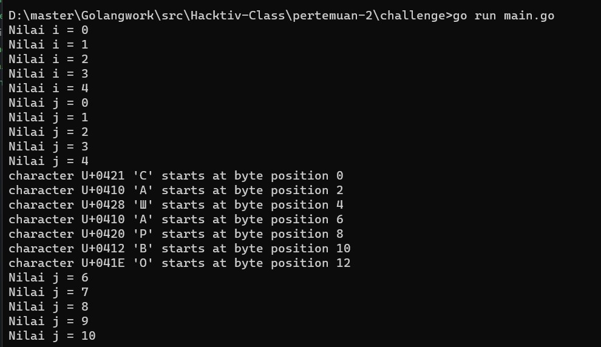

# Challenge - Pertemuan 2

### Program Golang
```go
package main

import "fmt"

func main() {
	var (
		rusia = []rune{'\u0421', '\u0410', '\u0428', '\u0410', '\u0420', '\u0412', '\u041E'}
		val   = "i"
	)

loop:
	for i := 0; i <= 10; i++ {
		if i == 5 && val != "j" {
		   val = "j"
		   goto loop
		} else if i == 5 {
		   for j, value := range rusia {
			  fmt.Printf("character %U '%c' starts at byte position %d\n", value, value, j*2)
		  }
		} else {
			fmt.Printf("Nilai %s = %d\n", val, i)
		}
	}
}

```
[*Klik untuk mengakses program golang*](https://github.com/rizwijaya/Go-Challenge/blob/master/pertemuan-2/challenge/main.go)

#### Hasil Saat Dijalankan

