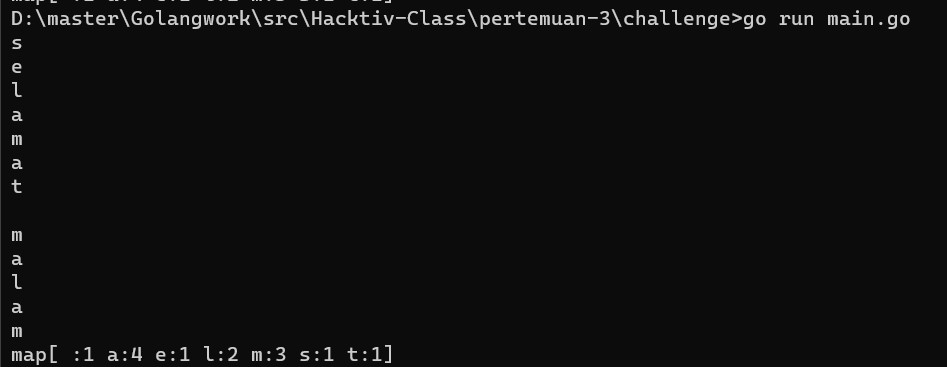

# Challenge - Pertemuan 3

### Program Golang
```go
package main

import "fmt"

func calcWord(s string) map[string]int {
	m := make(map[string]int)
	for _, v := range s {
		fmt.Println(string(v))
		m[string(v)]++
	}
	return m
}

func main() {
	s := "selamat malam"
	fmt.Print(calcWord(s))
}

```
[*Klik untuk mengakses program golang*](https://github.com/rizwijaya/Go-Challenge/blob/master/pertemuan-3/challenge/main.go)

#### Hasil Saat Dijalankan

